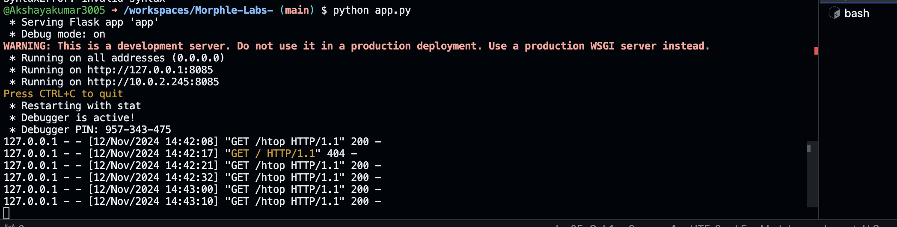
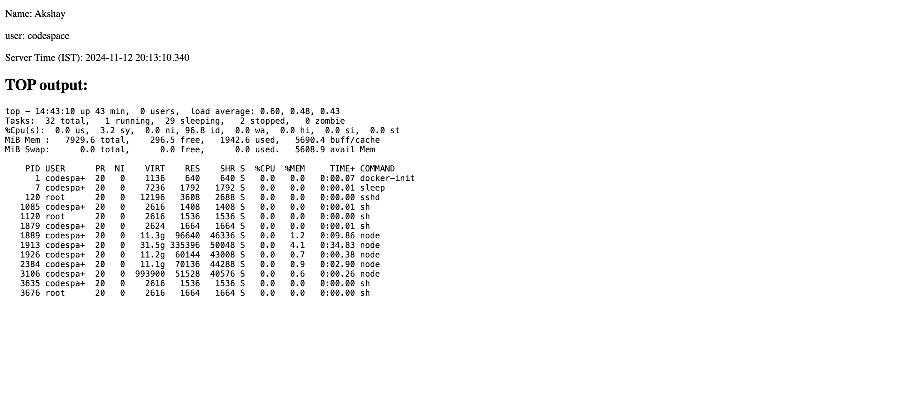

# HTOP Endpoint

This is a Flask-based web application that displays system information, including the current user, server time in IST, and a snapshot of the top processes running on the server.

## Features
- Shows the server's current time in IST.
- Fetches and displays the output of the `top` command (first 20 lines), which provides a snapshot of system processes.

## Requirements
- Python 3.x
- Flask
- `pytz` for time zone management

## Setup

1. **Clone the repository:**
   ```bash
   git clone https://github.com/Akshayakumar3005/Morphle-Labs-.git
   cd Morphle-Labs-

2. **Install necessary python libraries:**
   ```bash
   pip install Flask pytz

3. **Run the application:**
   ```bash
   python app.py

## Output Screenshots




